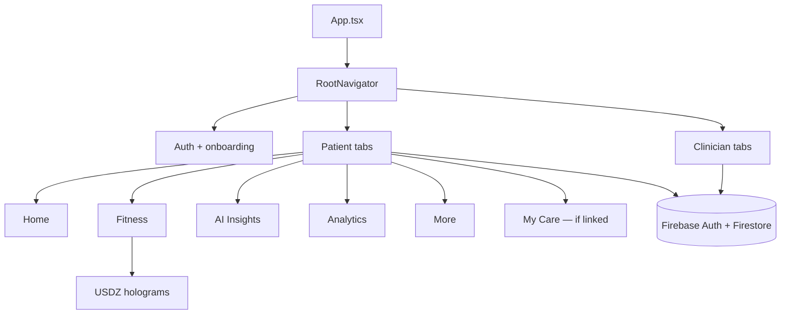

# WellnessShift

Patient wellness app and clinician portal, built in React Native for **iOS** and **Android**.

People get a daily plan, fitness and anatomy learning, AI insights, and (when linked) a clinician care plan. Clinicians manage patients, send modules, and follow progress in the same Firebase project.

| | |
|---|---|
| Website | [wellnessshift.co.uk](https://wellnessshift.co.uk) |
| Firebase | `wellnessshift-rn-ios` |
| iOS bundle | `afras.wellnessshiftrn.ios` |
| Android id | `afras.wellnessshiftrn.android` |
| Stack | React Native 0.86 · React 19 · TypeScript · Firebase |

---

## Contents

- [Who it’s for](#who-its-for)
- [What you can do in the app](#what-you-can-do-in-the-app)
- [How the app is structured](#how-the-app-is-structured)
- [3D holograms](#3d-holograms)
- [Tech stack](#tech-stack)
- [Repository layout](#repository-layout)
- [Run locally](#run-locally)
- [Backend](#backend)
- [Subscriptions](#subscriptions)
- [More docs](#more-docs)
- [Troubleshooting](#troubleshooting)

---

## Who it’s for

**Patients** sign up (or sign in), complete onboarding and a wellness quiz, then land in a tabbed app: Home, Fitness, AI Insights, Analytics, More. If a clinician is connected, a **My Care** tab appears with assigned tasks.

**Clinicians** use a separate portal: dashboard, patient list, care-plan templates, Fitness Hub recommendations, messaging, and practice settings.

Roles are stored in Firebase (`registeredUsers` / `patients` / `clinicians`). Root navigation routes on auth state, email verification, onboarding, and role.

---

## What you can do in the app

### Patient

| Area | What’s there |
|------|----------------|
| **Auth & onboarding** | Email, Sign in with Apple, optional Google. Purpose / role, quiz, results, habits, HealthKit or Health Connect permission, notifications, paywall |
| **Home** | Wellness score, daily plan, check-ins, steps / activity, body metrics, food scan, health records, care-plan banner |
| **Fitness** | Module library, workouts, nutrition, meditation, breathing, calculators, anatomy holograms, guided programs |
| **AI Insights** | Feed of insights plus health-coach chat (OpenAI via Cloud Functions) |
| **Analytics** | Score history, category detail, progress, PDF / export |
| **More** | Profile, subscription, connect clinician, habits, social, messages, privacy, help |
| **My Care** | Clinician care-plan tasks — open a linked Fitness module, mark done, return to the plan |

### Clinician

| Area | What’s there |
|------|----------------|
| **Home** | Practice dashboard |
| **Patients** | List, detail, notes, bulk actions, add via invite |
| **Care** | Create / send care plans, templates, Fitness Hub recommendations (also written as care-plan tasks) |
| **Insights** | Practice analytics |
| **Inbox** | Patient messages |
| **Settings** | Profile, practice mode, audit log |

---

## How the app is structured



State lives in **Zustand**. Native health, IAP, notifications, Crashlytics, and Contentsquare are initialised from `App.tsx`. Config flags (demo mode, Google, App Check, etc.) are in `src/config/appConfig.ts`.

---

## 3D holograms

Same USDZ files as the original native iOS app (`ios/WellnessShift/Models/`). Android copies them into the APK at build time.

| Platform | Viewer |
|----------|--------|
| iOS | SceneKit native view — `ios/WellnessShift/HologramSceneView.swift` |
| Android | WebView + Three.js `USDLoader` — source `src/hologram/androidHologramViewer.ts`, bundled to `android/app/src/main/assets/hologram/` |

Models in Fitness / Anatomy:

| Title | USDZ | Preset |
|-------|------|--------|
| Beating Heart | `Beating-heart` | `beatingHeart` |
| Heart & Lungs | `adult_heart_and_lungs` | `heartLungs` |
| Heart & Bronchial Airways | `adult_heart_and_bronchial_airways` | `heartBronchial` |
| Brain | `Brain_hologram` | `brain` |
| Lungs | `Struktur_Paru-Paru_Manusia_3D_Model` | `lung` |
| Stomach | `Realistic_Human_Stomach` | `stomach` |
| Skeleton | `Free_Pack_-_Human_Skeleton` | `skeleton` |
| Écorché | `Male_Full_Body_Ecorche` | `ecorche` |
| Anatomy study | `Ecorche_-_Anatomy_study` | `anatomy` |

After editing the Android viewer TypeScript:

```bash
npm run bundle:hologram
npm run android
```

Android debug JS is compiled into the APK (`debuggableVariants = []`). Metro reload alone will not pick up hologram or native changes.

---

## Tech stack

| Layer | Choice |
|-------|--------|
| UI | React Native 0.86, React Navigation v6, Reanimated, SVG |
| State | Zustand |
| Charts | react-native-gifted-charts |
| Local storage | react-native-mmkv |
| Backend | Firebase Auth, Firestore, Functions, Hosting, Messaging, Crashlytics, Remote Config |
| iOS health | HealthKit (`react-native-health`) |
| Android health | Health Connect (`react-native-health-connect`) |
| Payments | react-native-iap (StoreKit / Play Billing) |
| Auth extras | Apple, Google Sign-In |
| Analytics / replay | Contentsquare (opt-out in Profile) |

---

## Repository layout

```
App.tsx
src/
  config/           App + Google / Contentsquare local secrets
  navigation/       Auth, patient tabs, clinician tabs, stacks
  screens/          auth, home, fitness, insights, analytics, more, clinician
  components/       Shared UI
  services/         Firebase, AI, health, IAP, care plans, notifications
  hologram/         Android Three.js viewer source
  store/            Zustand
  theme/            Colour, type, spacing
ios/WellnessShift/  SceneKit holograms, USDZ, Info.plist, GoogleService-Info.plist
android/app/        Native hologram WebView, google-services.json
functions/          Cloud Functions (AI proxy, etc.)
public/             Hosting — email verified / auth-action page
firestore.rules
```

---

## Run locally

**Need:** Node 18+, Xcode 16+ (iOS 26 simulators are fine), Android Studio + emulator, CocoaPods, Watchman. Do not install the old global `react-native-cli`.

```bash
npm install
cd ios && pod install && cd ..
npm start
```

In another terminal:

```bash
npm run ios
# or
npx react-native run-ios --simulator "iPhone 17 Pro"

npm run android    # adb reverse 8081, then install
```

Firebase plists/json are already in the repo. Google Sign-In stays hidden until you put a Web client ID in `src/config/googleAuth.local.ts`.

Clean rebuild both platforms (native / hologram changes):

```bash
cd android && ./gradlew clean && cd ..
xcodebuild -workspace ios/WellnessShift.xcworkspace -scheme WellnessShift -configuration Debug clean
npm run android
npx react-native run-ios --simulator "iPhone 17 Pro"
```

### npm scripts

| Script | What it does |
|--------|----------------|
| `npm start` | Metro (`--host 0.0.0.0`) |
| `npm run ios` | Install on iOS simulator |
| `npm run android` | Install on Android + dismiss 16KB compat dialog |
| `npm run bundle:hologram` | esbuild Android `viewer.js` |
| `npm run deploy:rules` | Firestore rules |
| `npm run functions:deploy` | Cloud Functions |
| `npm run deploy:backend` | Firestore + Functions |
| `npm run deploy:hosting` | Email-verified hosting page |
| `npm run generate:icons` | App icons |

---

## Backend

Email verification continue URL:

`https://wellnessshift-rn-ios.firebaseapp.com/email-verified.html`

Typical Firestore areas: `users` (scores, daily plans, care plans, check-ins), `patients` / `clinicians`, `messageThreads`, `connectionRequests`, `inviteCodes`.

---

## Subscriptions

Product IDs in `src/services/iap.ts` (must match App Store Connect / Play Console):

| Product ID | Tier |
|------------|------|
| `com.wellnessshift.growth.monthly` | Growth |
| `com.wellnessshift.growth.yearly` | Growth |
| `com.wellnessshift.pro.monthly` | Pro |
| `com.wellnessshift.pro.yearly` | Pro |

Production checklist (IDs, privacy, Contentsquare): [docs/APP_STORE_SETUP.md](docs/APP_STORE_SETUP.md).

---

## More docs

| File | Topic |
|------|--------|
| [ARCHITECTURE_DIAGRAM.md](ARCHITECTURE_DIAGRAM.md) | Navigators, data, services |
| [docs/APP_STORE_SETUP.md](docs/APP_STORE_SETUP.md) | Store + Firebase IDs |
| [docs/contentsquare-webview-tag-web-team.md](docs/contentsquare-webview-tag-web-team.md) | Session replay / WebViews |

`XCODE_SETUP.md` and the `NATIVE_IOS_*` notes are from the original port and are not current runbooks.

---

## Troubleshooting

- **Android hologram / native change not showing** — full `npm run android`, not a Metro reload. Re-run `npm run bundle:hologram` if you edited the viewer TS.
- **iOS hologram missing** — USDZ must be in the app bundle (`ios/WellnessShift/Models/`).
- **Google button missing** — empty or `YOUR_` web client ID.
- **Care plan back goes to Home** — opening a module from My Care should return via `fromCarePlan` (Fitness / Home stacks).
- **16KB emulator dialog on Android** — `scripts/dismiss-android-compat-dialog.sh` runs after `npm run android`.
